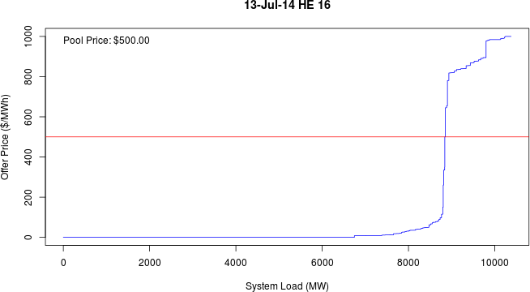

```{r, echo=FALSE}

#   Check if pool price was already downloaded; otherwise download to date-stamped file.
get.pp <- function(d) {
    
    #   Determine pool price URL from input date.
    d.mdyn <- format(d, "%m%d%Y")
    pp.url <- paste("http://ets.aeso.ca/ets_web/ip/Market/Reports/HistoricalPoolPriceReportServlet?",
                    "beginDate=",d.mdyn,
                    "&endDate=",d.mdyn,
                    "&contentType=csv",
                    sep="")
    
    #   Return daily pool price dataset to caller.
    return(read.table(pp.url, sep=",", blank.lines.skip=TRUE, skip=3, header=TRUE))

}

#   Load and clean daily pool price
load.pp <- function(d) {
    
    pp <- get.pp(d)
    names(pp) <- c("Date.HE", "Price", "RAvg.30d", "System.Demand")
    
    pp <- cbind(pp,
                t(matrix(unlist(strsplit(as.character(pp$Date.HE), " ")), nrow=2, ncol=24, dimnames=list(c("Date","HE"), NULL))))
    pp <- transform(pp, 
                    Date = as.POSIXct(Date, format="%m/%d/%Y"),
                    HE = as.numeric(HE))
    
    return(pp)
}

#   Plot pool price.
plot.pp <- function(d.in) {
    
    d <- as.POSIXct(format(as.Date(d.in, format="%d-%b-%Y"), "%Y-%m-%d"), format="%Y-%m-%d")
    pp <- load.pp(d)
    
    plot(Price ~ HE, data=pp, type="l", col="blue",
         main=paste("Pool Price:", format(d, "%d-%b-%Y")),
         xlab="Hour Ending",xlim=c(0,25),
         ylab="Pool Price ($/MWh)")
    
    abline(h=pp$Price[c(which.min(pp$Price), which.max(pp$Price))], col="darkgoldenrod1")
    points(Price ~ HE, data=pp[c(which.min(pp$Price), which.max(pp$Price)),], pch=21,
           col="black", bg="darkorange")

    text(x=pp$HE[which.min(pp$Price)], y=min(pp$Price), pos=3,
         paste("$",formatC(min(pp$Price), format="f", digits=2),sep=""))
    text(x=pp$HE[which.max(pp$Price)], y=max(pp$Price), pos=1,
         paste("$",formatC(max(pp$Price), format="f", digits=2),sep=""))
    
}

```

##  Pool Price

The price of electricity in the Alberta market can be extremely volatile. Hourly prices can range between $0 and $1000/MWh. 

<iframe src = 'http://ets.aeso.ca/ets_web/ip/Market/Reports/ActualForecastWMRQHReportServlet?contentType=html' height='600px'></iframe>

---

##  Stable Pool Price

In some days, pool price may remain low and stable in all hourly intervals.

``` {r, echo=FALSE}
plot.pp("11-Jul-2014")
```

---

##  Volatile Pool Price

In other days, pool price may vary by hundreds of dollars between hourly intervals.

``` {r, echo=FALSE}
plot.pp("13-Jul-2014")
```

---

##  Energy-Market Merit Order

The energy-market merit order provides insight into the system demand and participant offer behaviour that determines pool price in each hour. The Shiny application permits a user to view the EMMO in each hourly interval, and interpret the market conditions that influenced pool price.

[](https://mmacrae.shinyapps.io/emmo/)

Click the picture to launch the app.