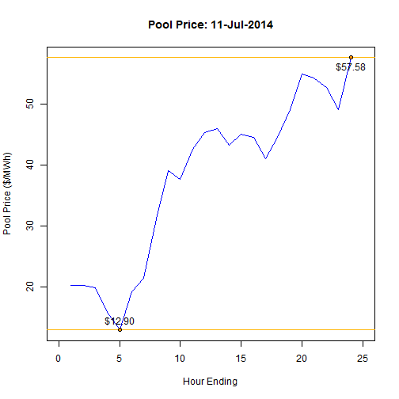
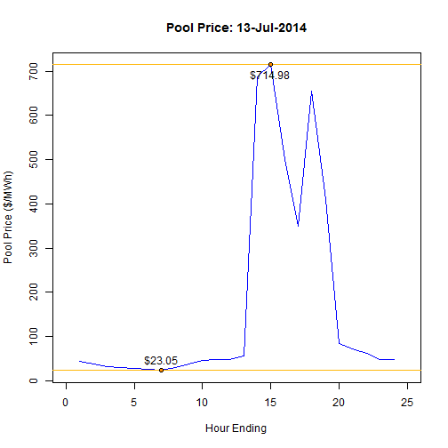

##  Pool Price

The price of electricity in the Alberta market can be extremely volatile. Hourly prices can range between $0 and $1000/MWh. 

<iframe src = 'http://ets.aeso.ca/ets_web/ip/Market/Reports/ActualForecastWMRQHReportServlet?contentType=html' height='600px'></iframe>

---

##  Stable Pool Price

In some days, pool price may remain low and stable in all hourly intervals.

 

---

##  Volatile Pool Price

In other days, pool price may vary by hundreds of dollars between hourly intervals.

 

---

##  Energy-Market Merit Order

The energy-market merit order provides insight into the system demand and participant offer behaviour that determines pool price in each hour. The Shiny application permits a user to view the EMMO in each hourly interval, and interpret the market conditions that influenced pool price.

Click the picture to launch the app.
